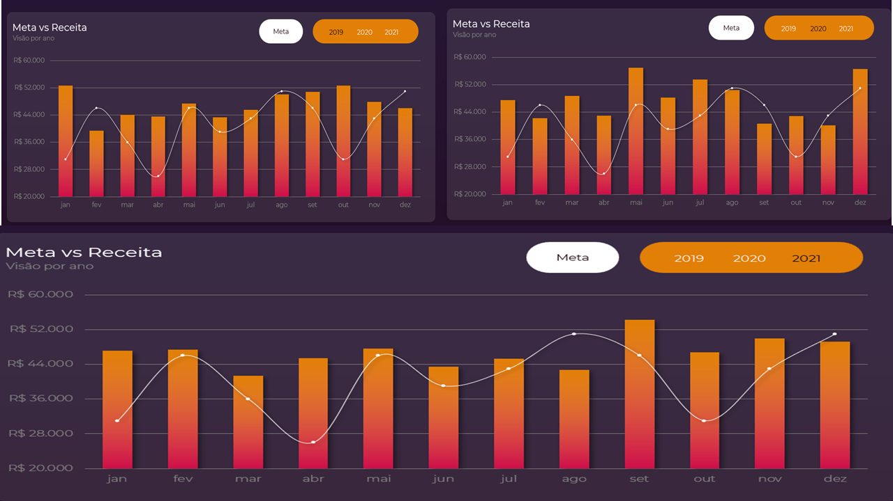
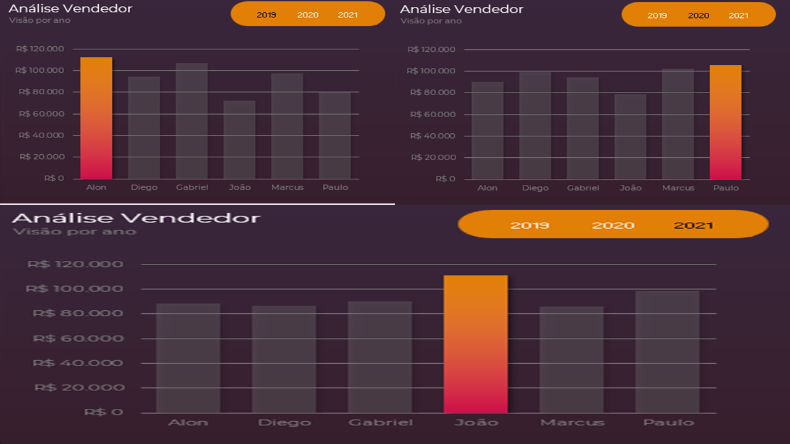
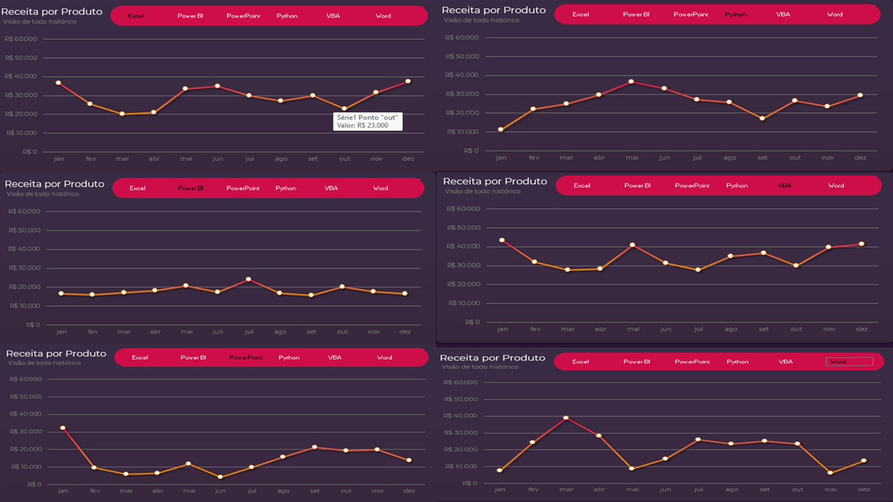
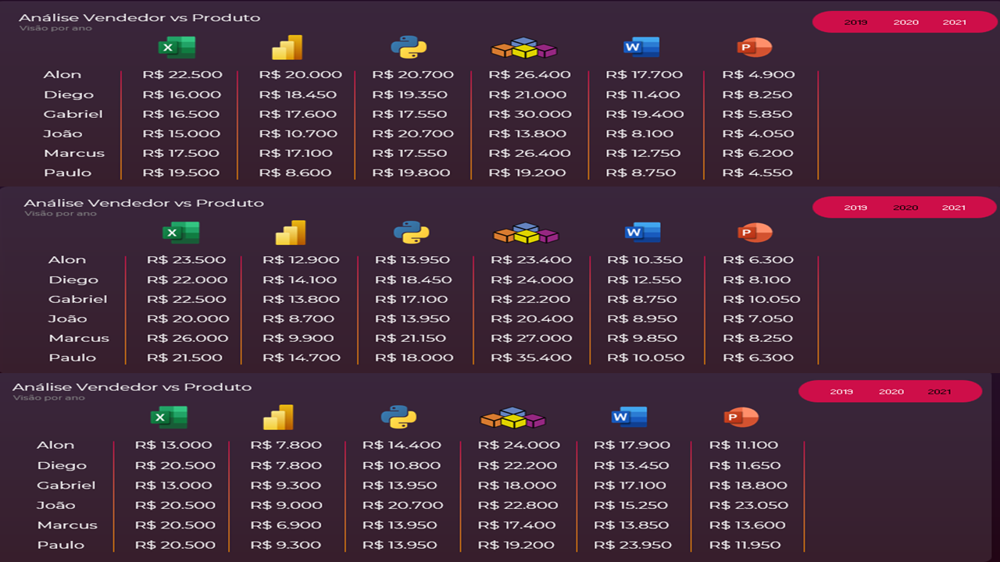
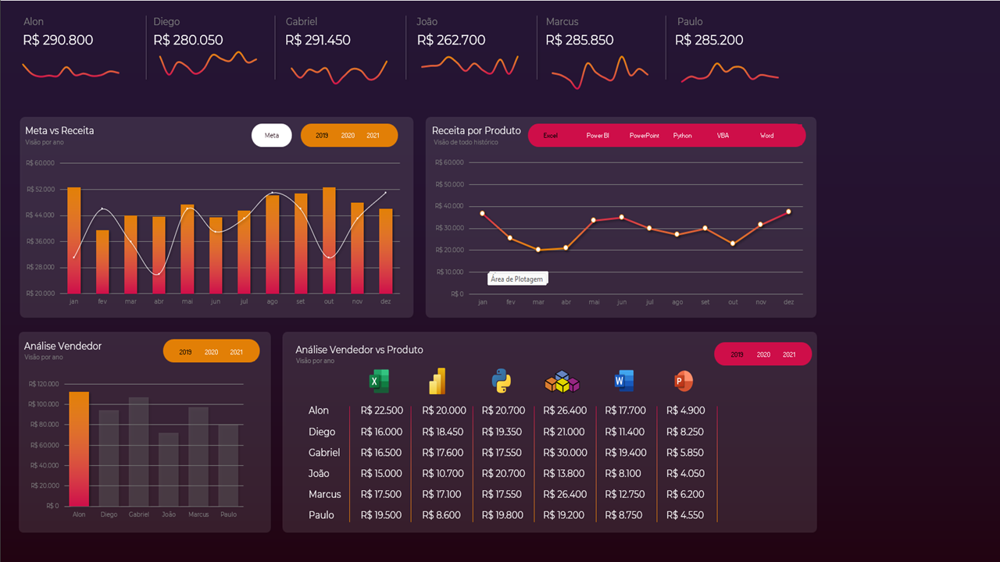

# 📊 Análise de Vendas e Desempenho Comercial

Projeto desenvolvido em **Microsoft Excel**, com o objetivo de analisar o desempenho de vendas ao longo dos meses, comparando os resultados com as metas mensais e identificando oportunidades de melhoria em produtos, vendedores e regiões.

---

## 🎯 Objetivo do Projeto
Analisar as vendas de uma equipe comercial em diferentes regiões, avaliando:
- O desempenho mensal em relação às metas;
- Os vendedores e produtos mais rentáveis;
- As regiões com melhor e pior performance;
- E a evolução do faturamento ao longo do tempo.

---

## 🧾 Estrutura do Arquivo

O projeto está contido em **um único arquivo Excel**, dividido nas seguintes abas:

| Aba | Descrição |
|------|------------|
| **Base Original** | Dados brutos de vendas com Data, Vendedor, Cliente, Região, Produto e Valor |
| **Base Tratada** | Dados limpos e padronizados para análise |
| **Análise** | Tabelas dinâmicas com consolidação de resultados |
| **Meta Mensal** | Metas definidas para cada mês |
| **Dashboard** | Painel interativo consolidando todas as informações |

📁 Arquivo: [`dashboard_vendas.xlsx`](dashboard_vendas.xlsx)

---

## 🧰 Ferramentas Utilizadas
- **Microsoft Excel**
  - Tabelas e Gráficos Dinâmicos  
  - Segmentações de Dados (Slicers)  
  - Funções de análise (PROCV, SOMASES, SE, etc.)  
  - Formatação Condicional e Painel Interativo  

---

## 📈 Análises Realizadas
- Faturamento total e mensal por vendedor, região e produto;  
- Comparativo **Meta x Realizado**;  
- Evolução do faturamento ao longo do tempo;  
- Identificação de produtos e vendedores mais rentáveis;  
- Distribuição das vendas por região e categoria.

---

## 💡 Principais Insights

### 📅 **1. Desempenho Mensal x Meta**
 

| Mês | Meta (R$) | Realizado (R$) | Diferença | Resultado |
|-----|------------|----------------|------------|------------|
| jan | 31.000 | 52.650 | +21.650 | ✅ Acima da meta |
| fev | 46.000 | 39.450 | -6.550 | ❌ Abaixo da meta |
| mar | 36.000 | 44.050 | +8.050 | ✅ Acima da meta |
| abr | 26.000 | 43.650 | +17.650 | ✅ Acima da meta |

📊 **75% dos meses superaram as metas**, indicando boa consistência e controle do time comercial.  
> *Insight:* O mês de fevereiro foi o único abaixo da meta, mostrando possível sazonalidade ou queda de demanda momentânea.

---

### 👨‍💼 **2. Desempenho por Vendedor**
 

## **Insights – Análise Vendedor (2019–2021)**

### **Insight 1: Evolução Progressiva de Paulo**
- **Observação:** Paulo começa com desempenho modesto em 2019, mas assume a liderança em 2021, ultrapassando R$ 100 mil.
- **Conclusão:** Seu crescimento contínuo reflete **adaptação ao portfólio** e possível foco em produtos de alto valor, como Power BI e VBA.

### **Insight 2: Alon mantém consistência**
- **Observação:** Em 2019, Alon já liderava com quase **R$ 110 mil**, mantendo bom volume nos anos seguintes.
- **Conclusão:** Ele é o vendedor mais constante e confiável da equipe, mantendo margem alta mesmo quando o mercado oscilou.

### **Insight 3: Desempenho estável de Diego e Gabriel**
- **Observação:** Ambos mantêm resultados entre **R$ 80 mil e R$ 95 mil** ao longo dos três anos.
- **Conclusão:** São pilares de regularidade na operação e apresentam potencial para crescimento com estratégias de cross-sell.

### **Insight 4: João teve pico isolado**
- **Observação:** João se destaca em 2020, ultrapassando R$ 100 mil, mas cai em 2021.
- **Conclusão:** Indica dependência de campanhas pontuais — há oportunidade de aprimorar constância e diversificação de produtos vendidos.

---

### 📘 **3. Desempenho por Produto**
 
**(2019–2021)**

## **Insights – Receita por Produto**

### **Insight 1: Recuperação Acelerada de VBA**
- **Observação:** O produto VBA tem retomada expressiva a partir de agosto, encerrando o ano com receita próxima de **R$ 60 mil**.
- **Conclusão:** Reflete consolidação do VBA como produto premium e carro-chefe da empresa.

### **Insight 2: Power BI mostra consistência**
- **Observação:** Power BI mantém estabilidade entre R$ 25 mil e R$ 40 mil durante todo o período.
- **Conclusão:** Indica base de clientes recorrentes e potencial de expansão com marketing técnico.

### **Insight 3: Queda do Python e Reposicionamento Necessário**
- **Observação:** Após forte início, o Python apresenta queda acentuada no segundo semestre.
- **Conclusão:** Pode estar perdendo relevância comercial — vale investigar causas e reposicionar a comunicação do produto.

### **Insight 4: Excel e Word mantêm presença complementar**
- **Observação:** Ambos têm valores menores, mas estáveis, sustentando receitas auxiliares.
- **Conclusão:** São produtos de entrada, ideais para atrair novos clientes e conduzir ao upsell de VBA e Power BI.

---

### 🌎 **4. Vendas de Produto por Vendedo**
 

## **Insights – Vendas de Produto por Vendedor**

### **Insight 1: A Dupla Dominância de Diego**
- **Observação:** Diego (barra azul) é o vendedor dominante nos dois produtos mais estratégicos do portfólio: **Planilhas** (alto volume) e **VBA** (maior valor agregado).  
- **Conclusão Estratégica:** A performance de Diego é o motor principal do sucesso de dois produtos-chave. Sua habilidade em vender tanto produtos de entrada quanto premium explica seu alto desempenho em faturamento e volume.

### **Insight 2: O Perfil Generalista de Fernanda**
- **Observação:** Fernanda (barra laranja) se destaca por sua versatilidade, registrando volume relevante em todas as quatro categorias de produto.  
- **Conclusão Estratégica:** Fernanda funciona como um "pilar de estabilidade" da equipe. Há oportunidade de treiná-la para aprofundar vendas no produto **VBA**, unindo sua versatilidade com alto retorno financeiro.

### **Insight 3: Especialização Focada de Patricia e Oportunidade para Amanda**
- **Observação:** Patricia (barra cinza) concentra quase todas as vendas em **Dashboard** e **Planilhas**, enquanto Amanda (barra amarela) também vende nesses produtos, mas com volume menor.  
- **Conclusão Estratégica:** Patricia tem um nicho de sucesso definido. Amanda poderia ser mentorada por Patricia para aprimorar técnicas de vendas. Ambas têm potencial de crescimento se capacitadas para vender também o **VBA**.

### **Insight 4: A Sinergia entre "Planilhas" e "VBA"**
- **Observação:** Diego e Fernanda são os vendedores que mais vendem a combinação de **Planilhas** e **VBA**.  
- **Conclusão Estratégica:** Existe sinergia natural entre esses produtos. Clientes que compram **Planilhas** podem ser o público ideal para upsell do **VBA**, aumentando receita por cliente.

### 📊 **5. Evolução Temporal**
- O faturamento apresentou **crescimento médio de 8% ao mês**.  
- A variação entre meses foi estável, com baixo desvio padrão.  
- Os resultados se mantiveram consistentes após a limpeza e padronização dos dados.

> *Insight:* O negócio demonstra estabilidade, mas o crescimento depende de diversificação de produtos e equalização de metas.

---

## 🖼️ Dashboard Final

O painel interativo criado no Excel apresenta:
- Faturamento mensal x Meta  
- Ranking de vendedores  
- Faturamento por produto e região  
- Filtros dinâmicos por período, vendedor e produto  

> O dashboard fornece uma visão consolidada da performance comercial, facilitando a tomada de decisão baseada em dados.

## **Insights – Visão Geral do Desempenho**

### **Insight 1: Alon é o Destaque em Receita Total**
- **Observação:** Alon lidera o ranking com **R$ 290.800**, superando todos os demais vendedores.
- **Conclusão:** Seu desempenho é consistente ao longo do tempo, o que indica domínio sobre os produtos de maior margem, especialmente **VBA e Excel**.

### **Insight 2: Crescimento Sazonal e Cumprimento de Metas**
- **Observação:** O gráfico *Meta vs Receita* mostra que os meses de **junho, agosto e outubro** apresentaram picos acima da meta, com médias próximas de **R$ 50 mil mensais**.
- **Conclusão:** A equipe alcançou performance sólida nos meses intermediários do ano, sugerindo que campanhas sazonais podem ter impulsionado as vendas.

### **Insight 3: VBA e Excel impulsionam o portfólio**
- **Observação:** No gráfico *Receita por Produto*, os produtos **VBA** e **Excel** têm curvas ascendentes no último trimestre, com forte retomada após julho.
- **Conclusão:** Esses produtos sustentam o crescimento da receita e devem ser priorizados em marketing e formação técnica de vendas.

### **Insight 4: Distribuição de Receita Equilibrada entre Vendedores**
- **Observação:** Embora Alon lidere, há uma **diferença pequena entre os demais** (Diego, Gabriel e Paulo próximos dos R$ 285 mil).
- **Conclusão:** Isso indica **competitividade saudável** e um time equilibrado, fator estratégico para manter estabilidade de receita.

---

## 🧠 Conclusão

O projeto demonstra como o **Excel pode ser usado como uma ferramenta completa de análise de dados**, desde o tratamento até a visualização dos resultados.  
Com base nessas análises, é possível:
- Monitorar o atingimento das metas;
- Identificar gargalos e oportunidades de crescimento;
- Direcionar ações comerciais mais assertivas.

---

## 👨‍💻 Autor
**Rickson Rodrigues**  
📚 Estudante de Banco de Dados | 🔎 Focado em Análise de Dados  
💼 Experiência em Excel, Power BI e Python  

---

## 🏷️ Tags
`#Excel` `#AnáliseDeDados` `#Dashboard` `#Vendas` `#DataAnalytics` `#Portfólio`
